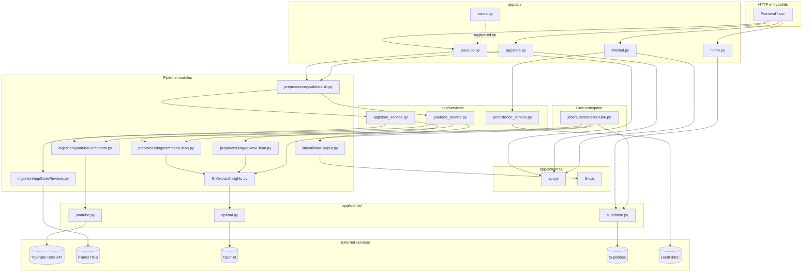

# Architecture: app/ Layered Refactor & Pytest Tree
Date: 2026-05-01

## Overview
Backend is split into layers — `api/` (HTTP), `services/` (orchestration), pipeline modules (`ingestion/`, `preprocessing/`, `llm/`), `clients/` (external service wrappers), `jobs/` (cron entrypoints), and `schemas/` (Pydantic boundary models). A top-level `tests/` tree mirrors `app/` and mocks every external service.

## Data Flow

### Manual analysis (HTTP)
HTTP request → [api/](../../app/api/) router → [schemas/api.py](../../app/schemas/api.py) validates body → [preprocessing/validateUrl.py](../../app/preprocessing/validateUrl.py) → [services/](../../app/services/) orchestrator → ingestion client → preprocessing → LLM → [llm/validateOutput.py](../../app/llm/validateOutput.py) → JSON response

### Weekly job (cron)
[jobs/automaticYoutube.py](../../app/jobs/automaticYoutube.py) → [clients/supabase.py](../../app/clients/supabase.py) (dedupe) → ingestion → preprocessing → LLM → [clients/supabase.py](../../app/clients/supabase.py) (write `automatic_table`)

## Components

| Component | File | Role |
|-----------|------|------|
| App factory | [app/main.py](../../app/main.py) | `create_app()`: CORS, four `include_router()` calls, registers exception handlers. |
| YouTube router | [app/api/youtube.py](../../app/api/youtube.py) | `POST /analyze/youtube` — validates URL, calls `youtube_service`. |
| App Store router | [app/api/appstore.py](../../app/api/appstore.py) | `POST /analyze/appStore` — validates URL, calls `appstore_service`. |
| Home router | [app/api/home.py](../../app/api/home.py) | `GET /get/homePage` — fetches three weekly category buckets from Supabase. |
| Internal router | [app/api/internal.py](../../app/api/internal.py) | `POST /data/send` (`include_in_schema=False`) — local-disk JSON dump. |
| Exception handlers | [app/api/errors.py](../../app/api/errors.py) | `RequestValidationError` + `StarletteHTTPException` → JSONResponse. |
| YouTube service | [app/services/youtube_service.py](../../app/services/youtube_service.py) | Orchestrates ingest → clean → extract → validate for manual analysis. |
| App Store service | [app/services/appstore_service.py](../../app/services/appstore_service.py) | Orchestrates iTunes RSS → clean → extract for manual analysis. |
| Persistence service | [app/services/persistence_service.py](../../app/services/persistence_service.py) | Writes JSON payload to `data/manually_change.json`. |
| Weekly job | [app/jobs/automaticYoutube.py](../../app/jobs/automaticYoutube.py) | Cron entrypoint; per-category loop with Supabase dedupe and writeback. |
| API schemas | [app/schemas/api.py](../../app/schemas/api.py) | `YoutubeAnalyzeRequest`, `AppStoreAnalyzeRequest`, `DataSave`. |
| LLM schema | [app/schemas/llm.py](../../app/schemas/llm.py) | Pydantic model for OpenAI insight output (problem/type/severity/frequency/total_likes). |
| Supabase client | [app/clients/supabase.py](../../app/clients/supabase.py) | Merged old `lib/db.py` + `lib/supabaseClient.py`; reads/writes `automatic_table`. |
| YouTube client | [app/clients/youtube.py](../../app/clients/youtube.py) | Wraps YouTube Data API v3 helpers (was `utilities/youtubeApiHelper.py`). |
| OpenAI client | [app/clients/openai.py](../../app/clients/openai.py) | Wraps the OpenAI chat-completion call (extracted post-spec, see deferred list). |
| YouTube ingestion | [app/ingestion/youtubeComments.py](../../app/ingestion/youtubeComments.py) | Fetches comments + popular videos via `clients/youtube.py`. |
| App Store ingestion | [app/ingestion/appStoreReviews.py](../../app/ingestion/appStoreReviews.py) | Paginated iTunes RSS scraper. |
| Comment cleaner | [app/preprocessing/commentClean.py](../../app/preprocessing/commentClean.py) | Filters YouTube comments by likes + keywords. |
| Review cleaner | [app/preprocessing/reviewClean.py](../../app/preprocessing/reviewClean.py) | Filters App Store reviews by votes. |
| URL validator | [app/preprocessing/validateUrl.py](../../app/preprocessing/validateUrl.py) | Regex-checks YouTube + App Store URLs before ingest. |
| Insight extractor | [app/llm/extractInsights.py](../../app/llm/extractInsights.py) | Sends cleaned text + prompt to OpenAI via `clients/openai.py`. |
| Output validator | [app/llm/validateOutput.py](../../app/llm/validateOutput.py) | Pydantic-validates LLM JSON against `schemas/llm.py`. |
| Test tree | [tests/](../../tests/) | Mirrors `app/`; `conftest.py` holds shared mock fixtures, `tests/fixtures/` holds sample JSON. |

## External Dependencies

| Service | Used For | Wrapper | Failure Impact |
|---------|----------|---------|----------------|
| YouTube Data API v3 | Comment + popular-video fetch | [clients/youtube.py](../../app/clients/youtube.py) | `/analyze/youtube` and weekly job halt; quota errors surface as 5xx. |
| iTunes RSS | App Store reviews | [ingestion/appStoreReviews.py](../../app/ingestion/appStoreReviews.py) (no client wrapper yet) | `/analyze/appStore` halts; no retry on rate-limit. |
| OpenAI API (gpt-4o) | Insight extraction | [clients/openai.py](../../app/clients/openai.py) | All analysis paths halt; sync call blocks the request. |
| Supabase (`automatic_table`) | Weekly dedupe + read/write of weekly insights | [clients/supabase.py](../../app/clients/supabase.py) | `/get/homePage` returns 503 per category; weekly job aborts the affected video. |
| Local filesystem (`data/`) | `/data/send` JSON dump | [services/persistence_service.py](../../app/services/persistence_service.py) | 500 on IOError; only path that writes outside Supabase. |

## Failure Points

- **Layer-boundary regression** — an `api/` module importing `ingestion/`/`preprocessing/`/`llm/` directly bypasses the service layer; not enforced by lint, only by [tests/api/test_routes.py](../../tests/api/test_routes.py) mocking the service surface.
- **Schema split** — `schemas/api.py` (HTTP in) and `schemas/llm.py` (LLM out) must stay disjoint; cross-imports re-couple boundary directions.
- **Exception handlers** — `errors.register_exception_handlers(app)` must run after `include_router()` calls in `create_app()`; reorder breaks 422/HTTP error JSON shape.
- **`include_in_schema=False`** on `/data/send` and `/` — losing the flag leaks internal routes into OpenAPI.
- **Weekly job dedupe** — [jobs/automaticYoutube.py](../../app/jobs/automaticYoutube.py) relies on `check_youtube_id`; a Supabase outage silently re-extracts and double-writes.
- **OpenAI output drift** — `extractInsights` returns raw JSON string; `validateOutput` is the only guard against schema drift before response/Supabase write.
- **Test/code drift** — `tests/` mirrors `app/`; renames in `app/` without matching test moves leave silently-skipped suites.

## Diagram

