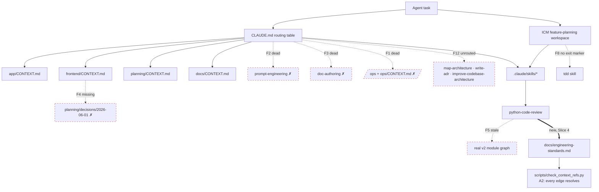

# Architecture: Context-system routing graph (engineering-standards-alignment)

Date: 2026-07-22

> Scope: the **context system** this spec repairs — root `CLAUDE.md`, the four
> domain `CONTEXT.md` files, the ICM workspace, the twelve skills, and the
> reference edges between them. This maps **what the graph is** and **which edges
> are broken**; the *why* and the fixes live in
> [engineering-standards-alignment_spec.md](../specs/engineering-standards-alignment_spec.md).
> This is not a runtime/pipeline map — there is no idea→gaps data flow here.

## Overview

An agent starting a task is routed by a graph of documents: root `CLAUDE.md`
names a domain, the domain's `CONTEXT.md` supplies constraints, and a skill
supplies the procedure that produces an artifact. Every edge is a reference that
must resolve on disk; the audit's 14 findings are **broken edges** in this graph.

## Data Flow

```
Agent task
  → CLAUDE.md routing table        (pick domain + skill by task type)
  → domain CONTEXT.md              (constraints, authority = PRD sections)
  → skill (.claude/skills/*)       (procedure)
  → artifact (spec / map / issues / code / ADR)
```

The ICM `feature-planning` workspace is a **second entry point** that sequences
the same skills through gated stages instead of one-off routing.

## Components

| Component | File | Role |
|-----------|------|------|
| Root router | `CLAUDE.md` | Routing table + naming conventions; always loaded (~450 tokens) |
| App context | `app/CONTEXT.md` | Backend layer rule (`api/ → services/`), pipeline constraints |
| Frontend context | `frontend/CONTEXT.md` | React 19 + Vite rules; cites the no-router ADR |
| Planning context | `planning/CONTEXT.md` | Pipeline flow, priorities, known constraints |
| Docs context | `docs/CONTEXT.md` | Doc-authoring conventions |
| ICM workspace | `icm/feature-planning/CONTEXT.md` | Sequences skills into gated stages 01–05 |
| Frame config | `icm/feature-planning/_config/feature-questions.md` | Stage-01 six-question kill gate |
| Skills (12) | `.claude/skills/<name>/SKILL.md` | Procedures the routing table points at |
| **Standard** *(new, Slice 1)* | `docs/engineering-standards.md` | Single authority `python-code-review` + `CLAUDE.md` cite |
| **Ref-checker** *(new, Slice 2)* | `scripts/check_context_refs.py` | Verifies every reference edge resolves (A2) |
| ADR home | `planning/decisions/` | One home for ADRs (currently only `.gitkeep`) |
| Run/deploy authority | `Makefile` | Where run/deploy lives after the `/ops` row is deleted |

## Reference edges and their targets

The map-architecture "external dependencies" for a doc-graph are the **on-disk
targets references must resolve to**. Failure impact = a dead route.

| Edge (source → target) | Resolves today? | Failure impact |
|------------------------|-----------------|----------------|
| `CLAUDE.md` → 12 skills | 10 of 12 | 2 dead (`prompt-engineering`, `doc-authoring`) → F2, F3 |
| `CLAUDE.md` → `/ops` + `ops/CONTEXT.md` | **No** | Whole workspace row dead → F1 (delete) |
| `frontend/CONTEXT.md` → `planning/decisions/2026-06-01-*` | **No** | Cited ADR absent → F4 (scaffold) |
| `write-adr` / `grill-with-docs` / `improve-codebase-architecture` → ADR home | Split | Two homes (`planning/decisions/` vs `docs/adr/`) → F7 |
| `python-code-review` → app module graph | Stale | Names deleted `/analyze/youtube`, wrong layer list → F5 |
| `python-code-review` → `docs/engineering-standards.md` | **New** | Created in Slice 4 (cite, don't restate) |
| ICM stage 05 → `tdd` skill | Unbounded | No "stop after planning" exit marker → F8 |

## Failure Points

Each broken edge, and the slice that repairs it. Full detail in spec §4.

- **Dead routes** — F1 `/ops` (delete row), F2 `prompt-engineering`, F3
  `doc-authoring`, F4 missing ADR (scaffold). → **Slice 2**.
- **Contradictions** — F5 `python-code-review` vs real v2 tree, F6 camelCase
  rule vs snake_case code, F7 two ADR homes. → **Slice 1 + Slice 4** (F6 rule
  settled in §5.1; rename deferred to follow-on).
- **Redundancy** — F8 `tdd` double-entry (→ **Slice 3**), F9 duplicate backend
  rows, F10 `grill-me`⊂`grill-with-docs`, F11 near-synonym planning rows (→
  **Slice 2**).
- **Orphans / staleness** — F12 three unrouted skills (`map-architecture`,
  `write-adr`, `improve-codebase-architecture`) (→ **Slice 2**), F13 stale
  workspace-spec OQ/artifact references (→ **Slice 3**).
- **Out of scope (N7)** — F14 empty `app/rag/` + `app/lib/` dirs and the
  "RAG deleted" contradiction; left to the follow-on conformance dive.
- **Workflow heuristic gap** — a *complete* spec arriving from outside the
  workflow trips the resume table into stage 03; it should enter at stage 01
  (confirm-pass). Sibling of F13. → **Slice 3**.

## Diagram



Solid edges resolve today; dashed red edges are the audit's broken references;
the bold edge is the new citation Slice 4 adds. `check_context_refs.py` is the
node that makes "every edge resolves" a checkable property rather than an audit.
