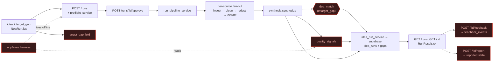

# Architecture: Scope-down core pipeline — blast radius of the cuts
Date: 2026-07-26

## Overview
Maps the **core loop we are keeping** (idea → gaps) and annotates exactly where
each surface being **removed** (#76, spec `scope-down-core-pipeline`) attaches to
it — so the implementer sees what disconnects and what must stay green. WHAT only;
the WHY is in [the spec](../specs/scope-down-core-pipeline_spec.md) §3 and the
recommended harness-cut ADR.

## Data Flow (the kept foundation)
`idea (+preflight) → approve → fan-out[ingest → clean → redact → idea-blinded extract] → synthesis → persist → gaps feed`

## Components — KEPT (the foundation)
| Component | File | Role |
|-----------|------|------|
| Create run + preflight | `app/api/runs.py` (`POST ""`), `app/services/preflight_service.py` | Classify category/signal, propose competitors (1 LLM call). |
| Approve → background run | `app/api/runs.py` (`POST /{id}/approve`), `app/services/run_pipeline_service.py::run_pipeline` | Kick the async pipeline over approved competitors. |
| Ingest | `app/ingestion/appStoreReviews.py`, `app/ingestion/youtubeComments.py` | Pull reviews/comments per source. |
| Clean | `app/preprocessing/reviewPipeline.py::clean` | Shared cleaning for both sources (KEEP). |
| Redact PII | `app/preprocessing/redact.py` | Strip PII at the persist boundary (KEEP). |
| Idea-blinded extract | `app/services/per_source_extraction_service.py::extract_per_source` | Per-source pain items + quotes; excludes `idea`/`target_gap`. |
| Synthesis | `app/llm/synthesis.py::synthesize` | Quote-then-claim ranked gaps, ≥2 quote-ID grounding. |
| Persist + feed | `app/services/idea_run_service.py`, `app/clients/supabase.py` | Insert gaps, mark done; serve `GET /runs`, `GET /{id}`. |
| Result UI | `frontend/src/RunResult.jsx`, `NewRun.jsx`, `MyRuns.jsx` | Idea input, ranked-gap display, feed. |

## Components — REMOVED (cut surfaces, with attach point)
| Cut surface | Attach point (file:role) | What disconnects |
|-------------|--------------------------|------------------|
| **eval harness** | `app/eval/harness.py`, `metrics.py`, `seed/`, `tests/eval/` | Offline driver of preflight + `run_pipeline`; its only consumer of `quality_signals`. Standalone — nothing in the request path imports it. |
| **quality_signals** | `run_pipeline_service.py::_safe_quality_signals/_compute_quality_signals`, `schemas/runs.py::QualitySignals`, `idea_run_service.py`, `clients/supabase.py`; col `idea_runs.quality_signals_json` | Computed post-synthesis, persisted, logged, never shown in UI. Remove the compute call + field + column. |
| **idea_match + target_gap** | `run_pipeline_service.py` L498 (`_set_stage("idea_match")` → `llm/idea_match.py::match_idea`), `synthesize(idea, target_gap, …)` signature, `llm/router.py` stage, `config/constants.py`, `schemas/runs.py` (`target_gap` ×3); frontend `NewRun.jsx` targetGap + `RunResult.jsx::IdeaMatchCard`; cols `idea_runs.target_gap`, `idea_runs.idea_match_json` | Optional branch after synthesis (only fires when `target_gap` set). Fold: drop the field/branch, simplify `synthesize()` to `idea` alone. |
| **feedback** | `api/runs.py` (`POST /{id}/feedback`) → `idea_run_service.py::submit_feedback` → `clients/supabase.py` feedback_events; `schemas/runs.py::RunFeedback`; `RunResult.jsx` feedback UI | Post-run write path; no reader in the pipeline. Drop endpoint + table + UI. |
| **report** | `api/runs.py` (`POST /{id}/report`) → `rate_limit_service.py::check_can_report` + `idea_run_service.py::report_run`; `schemas/runs.py::RunReport` + `reported` status; `RunResult.jsx` report UI | Sets `reported` lifecycle state (admin-hidden). Removing pulls the state out of the machine (PRD + CONTEXT + schema). |
| **preflight_raw_json** | col `idea_runs.preflight_raw_json` — **zero code refs** | Dead column; drop via dashboard, no code touch. |
| **dead weight** | `preprocessing/validateUrl.py` (+test), `utilities/textCleaning.py`, empty `app/rag/`, `app/lib/`, `app/data/`, `tests/rag/`, `tests/jobs/` | Unimported (validateUrl's only importer is its own test); empty shells. Delete. |

## External Dependencies
| Service | Used For | Failure Impact | Affected by cuts? |
|---------|----------|----------------|-------------------|
| OpenAI API | preflight, extraction, synthesis, (idea_match) | Pipeline halts | idea_match call removed — one fewer LLM call |
| YouTube Data API v3 | comment ingest | Source fails; run degrades to partial | No |
| iTunes / App Store Search | review ingest | Source fails; run degrades to partial | No |
| Supabase | persist `idea_runs`, `gaps`; `feedback_events` | Persist fails → run `failed` | `feedback_events` dropped; 4 columns dropped |

## Failure Points (cut-specific, what the slices must not break)
- **Synthesis signature change** (fold): `synthesize(idea, target_gap, …)` → `synthesize(idea, …)`. Every caller + test that passes `target_gap` breaks until updated — grep `target_gap` across both trees is the completeness check (spec R4).
- **`reported` state removal**: any reader of the status enum (admin-hidden feed filter, schema validation, PRD/CONTEXT docs) must be found, not just the endpoint (spec R3).
- **`quality_signals` removal**: `_safe_quality_signals` is deliberately exception-swallowing (`noqa: BLE001 — must never fail a run`); removing it is safe for the run path but its persisted column and the harness that reads it go together (spec D3).
- **DB drops have no migration to revert** (spec R5/N6): decouple "stop writing the column" (code) from "drop the column" (dashboard) so code lands first and the physical drop can lag safely.

## Diagram

_Red nodes = removed by #76. The unstyled path is the kept foundation._
